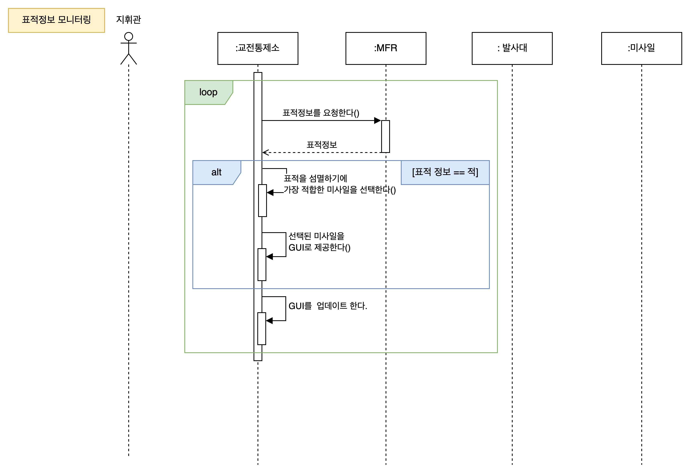
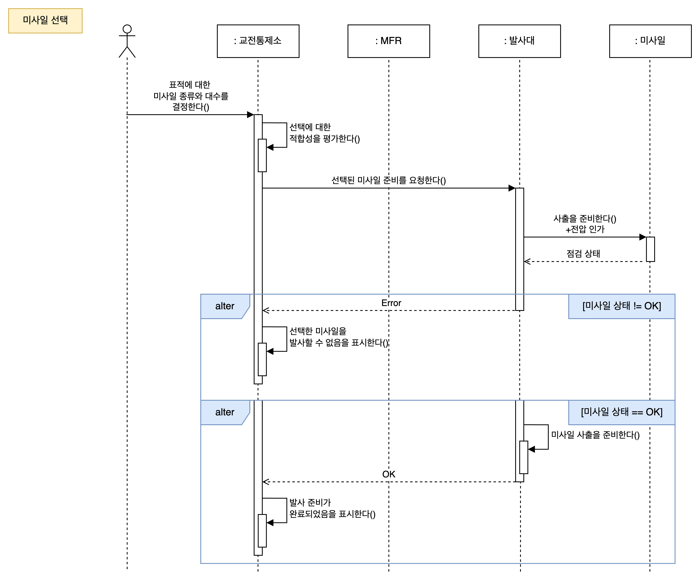
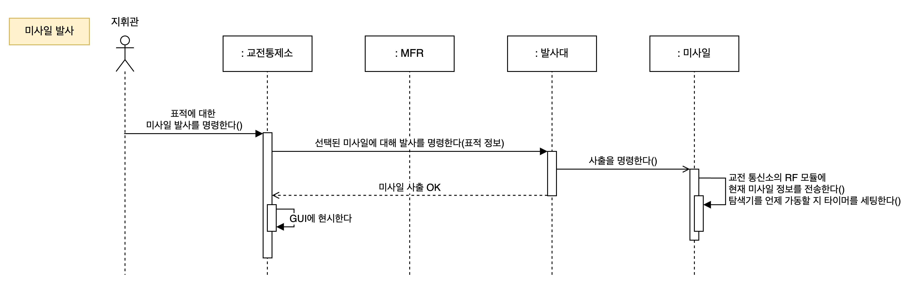
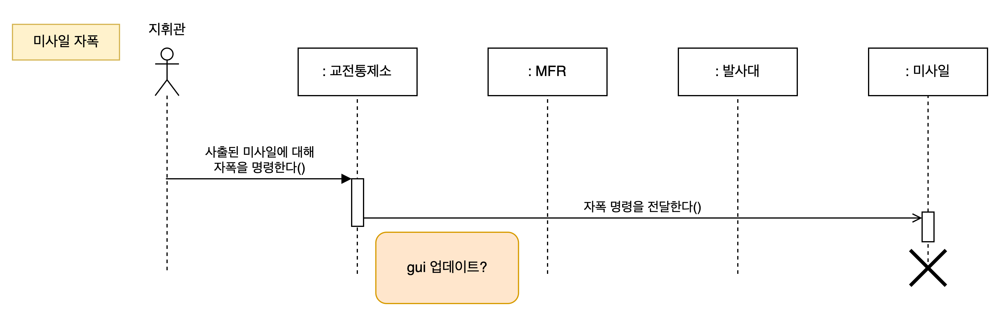
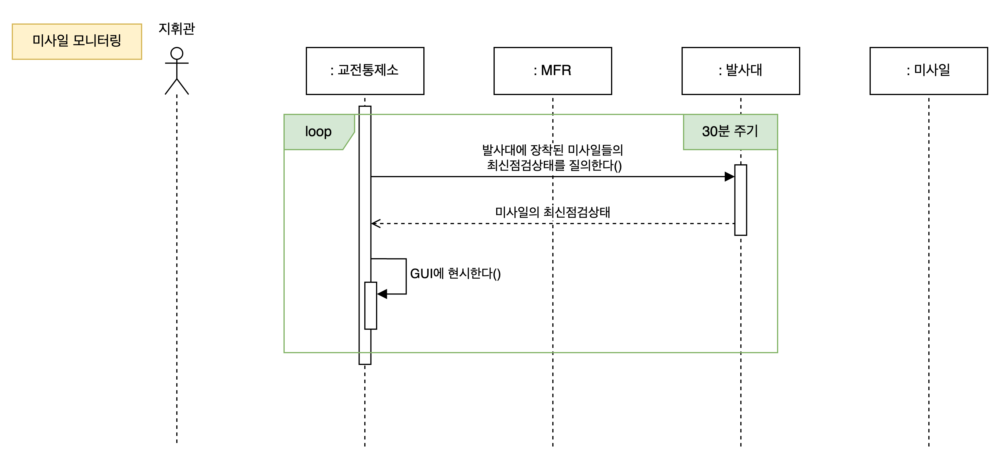
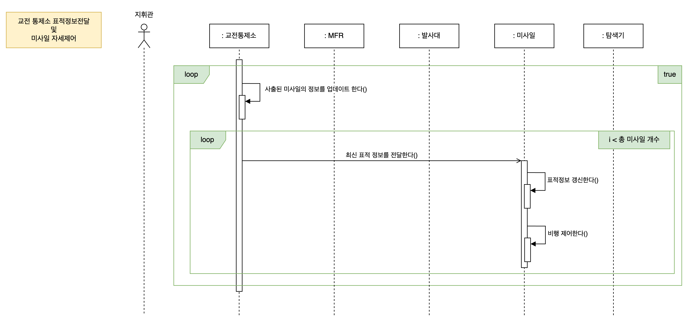
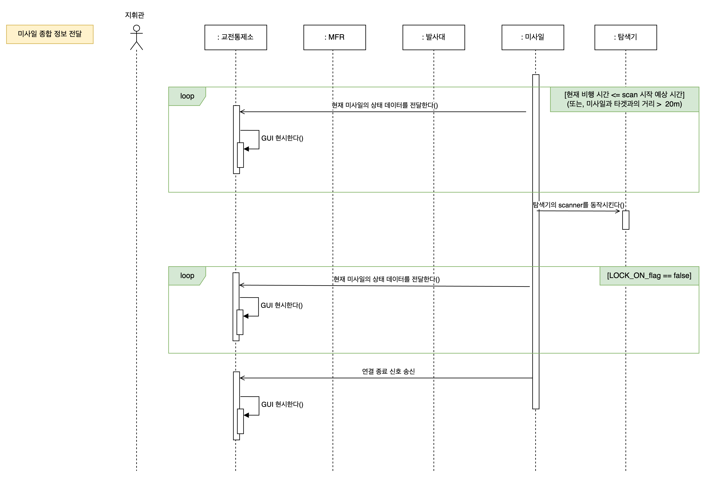
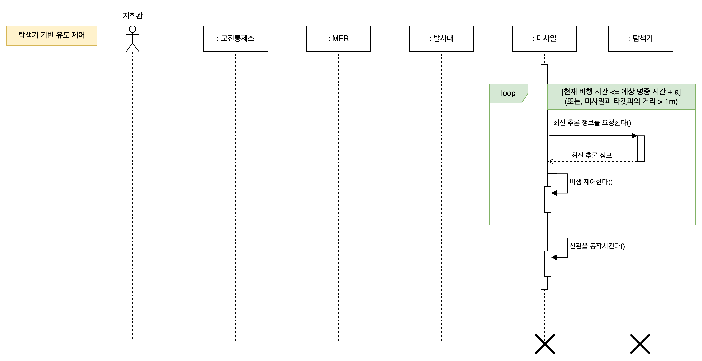

# 시퀀스 다이어그램

## 표적 정보 모니터링

## 미사일 선택 

## 미사일 발사

## 미사일 자폭

## 미사일 모니터링

## 교전통제소 표적정보 전달 및 미사일 자세제어

## 미사일 종합 정보 전달

미사일, ECS 통신 간 요청, 응답 불일치 문제에 대한 설계 고찰

<p1>
교전통제소와 미사일 간 통신이 RF로 이루어진다. 
요청과 응답의 흐름이 1대1로 이루어지지 않아 이상함을 발견하고 위와 같이 비동기 방식으로 수정하였다.
</p1>

## 탐색기 기반 유도 제어
