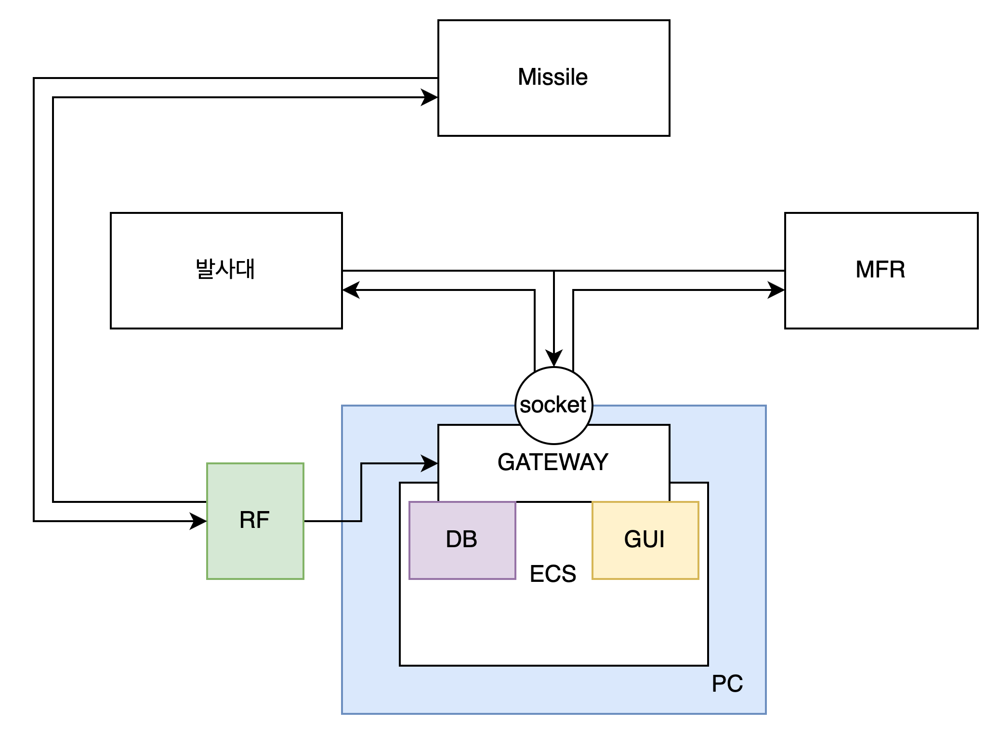
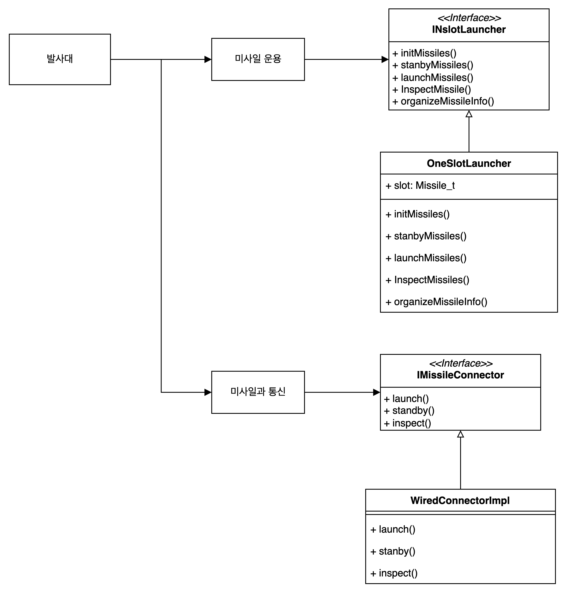
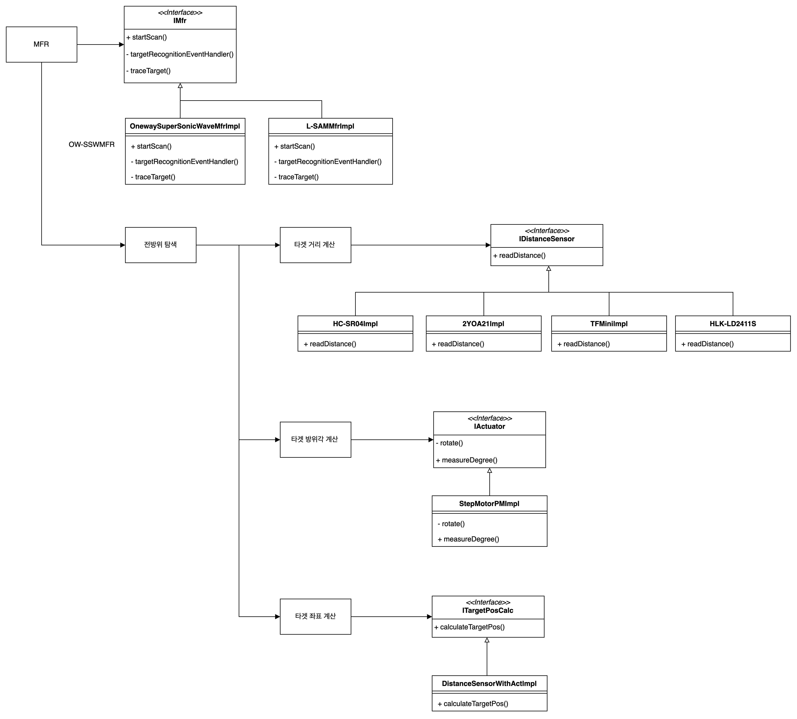
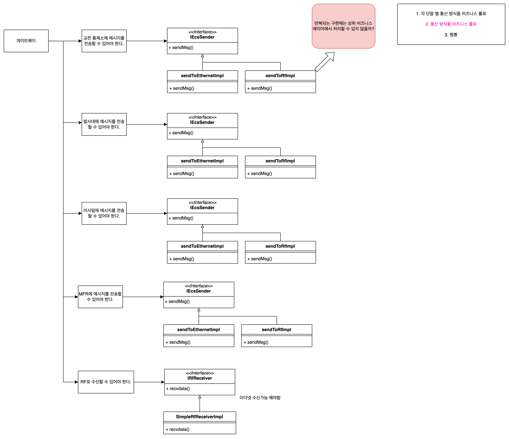

# System Architecture

- 전체 구조

## 발사대

## MFR

## 미사일

미사일 

<p1>
미사일의 존재 의의 
표적을 추적하여 섬멸할 수 있어야 하는 것. 
표적을 추적할 수 있어야 한다. -> 추적을 하려다 보니 항법이 필요한 것이다. 
 
정리: 항법은 표적 추적의 하위 비즈니스 룰이다.
</p1>

## ECS 설계

## Gateway 설계

