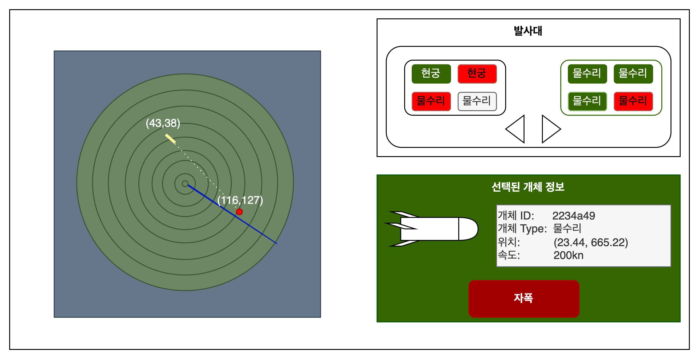

# 아키텍처 설계 과정

1. 요구사항을 기반으로 [🔗Use Case Scenario](Use_Case_Scenario.md) 작성
2. [🔗Use Case Diagram](Use_Case_Diagram.md) 작성
3. [🔗Sequence Diagram](Sequence_Diagram.md) 작성
4. 클래스의 속성, 기능, 클래스 사이 관계를 찾아 도메인 모델 작성(옵션)
5. 필요에 따라 상태 다이어그램 및 활동 다이어그램 추가
6. 서브 시스템 파악 후 전체 시스템 구조 설계

## GUI 예시
